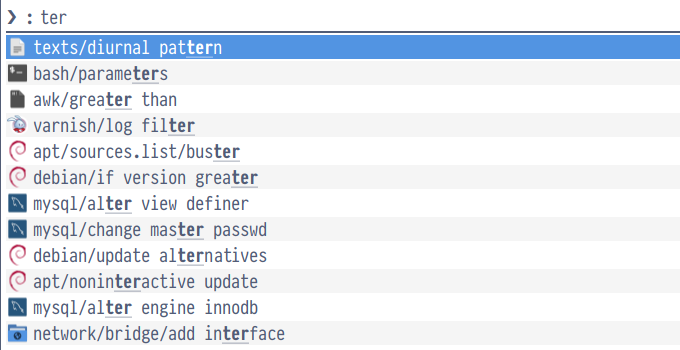
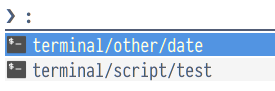

# Snippy

Snippy is a linux snippet manager with powerfull features !



## Install

### Arch Linux
[](https://aur.archlinux.org/packages/snippy-snippet/)

snippy is available on the [AUR](https://wiki.archlinux.org/index.php/Arch_User_Repository):
- [snippy-snippet](https://aur.archlinux.org/packages/snippy-snippet/) (source release package)

You can install it using your [AUR helper](https://wiki.archlinux.org/index.php/AUR_helpers) of choice.

Example:
```bash
$ yay -Sy snippy-snippet
```

### Download the script

```bash
# For your local user usage
curl -fsSL https://raw.githubusercontent.com/BarbUk/snippy/master/snippy --create-dirs --output ~/.bin/snippy
chmod +x ~/.bin/snippy

# Or install it systemwide
sudo curl -fsSL https://raw.githubusercontent.com/BarbUk/snippy/master/snippy --output /usr/bin/snippy
sudo chmod +x /usr/bin/snippy
```

## Features

### Clipboard

* Restore current clipboard after pasting the snippet
* `{clipboard}` placeholder to use current clipboard in snippet, ex:
```
CREATE DATABASE \`{clipboard}\` CHARACTER SET utf8 COLLATE utf8_general_ci;
```
* `{clipboard_urlencode}` placeholder to use current clipboard in snippet with urlencode format, ex:
```
https://cachedview.nl/#{clipboard_urlencode}
```

### Cursor

`{cursor}` placeholder to place the cursor

* go left to the correct position for cli and gui paste
  ```
  <pre>{cursor}</pre>
  ```

* go up for block snippet for gui paste
  ```
  <pre>
    {cursor}
  </pre>
  ```

### Parsing
* `##noparse` header in snippet to not parse/execute the snippet.
    ```
    ##noparse
    date --date="$(date +%F) -1 month" +%F
    ```
* directly execute command begining by `$`
* execute bash script in `$snippets_directory/scripts`
* copy script content when selection is selected by CTRL+Return, exemple:
  - with the following snippet: `$(date +%Y-%m-%d-%Hh%Mm%S)`
  - using Return will paste the current date
  - using CTRL+Return will paste the command directly

### Icons !

Icon name is set in rofi with the root directory name of your snippets.

If you have the following snippets, the `terminal` icon will be displayed in rofi:
```
    terminal/
    ├── other/
    │   └── date
    └── script/
        └── test
```



### Cli

```bash
# snippy -h

Usage:
	/usr/bin/snippy [OPTION] ACTION
	Snippy snippets manager
Options
	-h, --help: Show help
	-s, --sort: true or false Sort snippet in rofi (default)
	-m, --sorting-method: fzf (default) or levenshtein
Actions
	gui	 Browse snippet and paste it in the focused window (default)
	cli	 list snippet in cli mode, only copy snippet in the paste buffer
	edit	 Browse snippet and edit it
	add snippet_name	 Add a new snippet
	list	 list snippet
	cat	 list category
	completion	 bash completion
```

### Bash Completion

Snippy supports bash completion for all options and actions. To enable it, add the following to your `.bashrc` or `.bash_profile`:

```bash
eval "$(snippy completion)"
```

The completion will provide suggestions for:
- Options: `-h`, `--help`, `-v`, `--version`, `-s`, `--sort`, `-m`, `--sorting-method`
- Actions: `gui`, `cli`, `edit`, `add`, `list`, `cat`, `completion`
- Option values: `true`/`false` for `--sort`, `fzf`/`levenshtein` for `--sorting-method`
